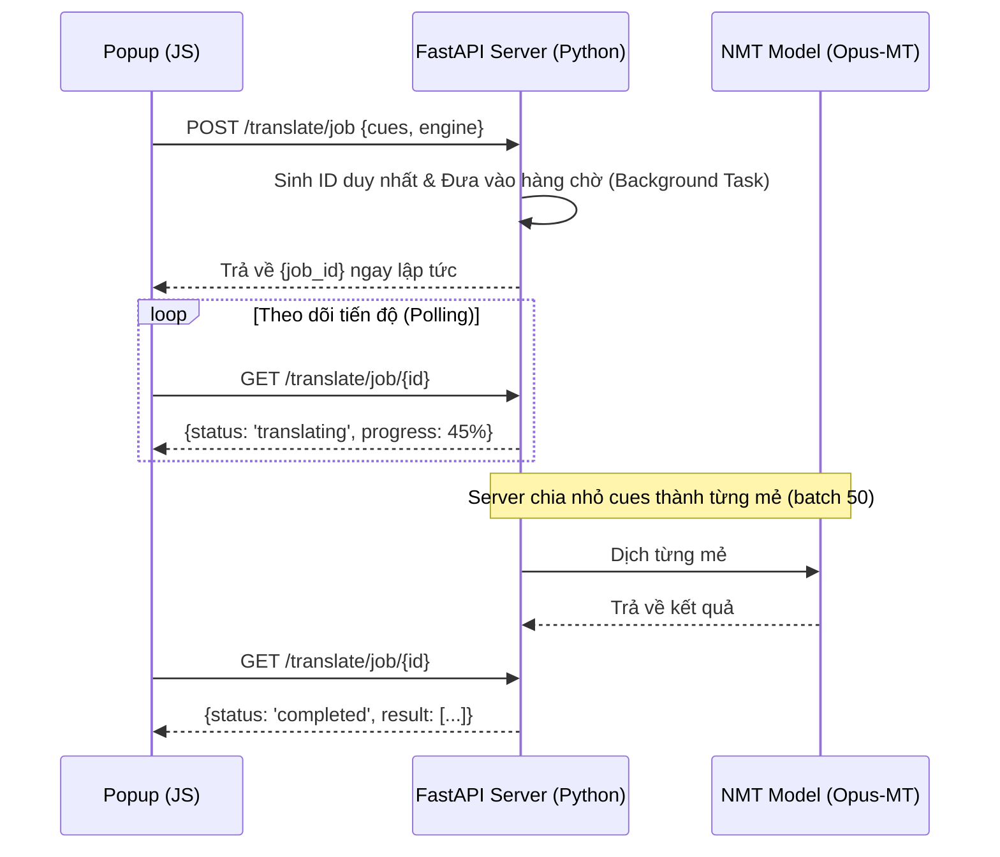
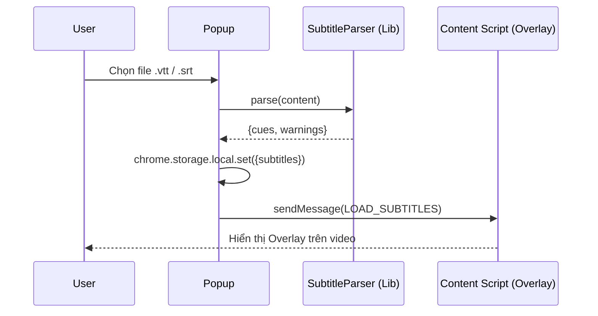
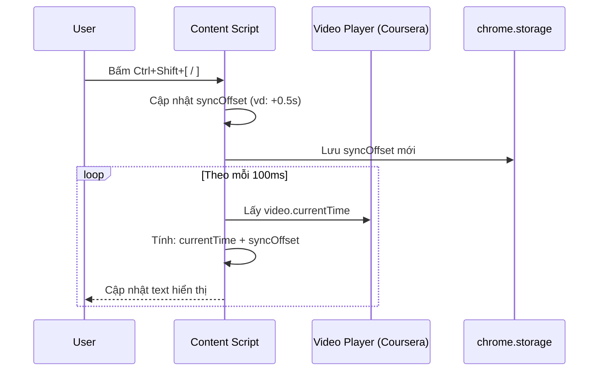
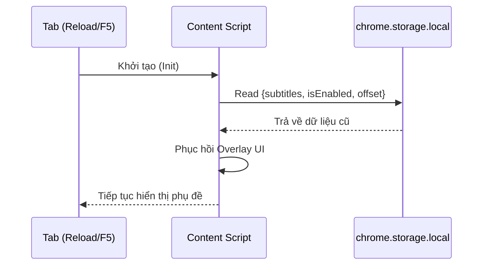
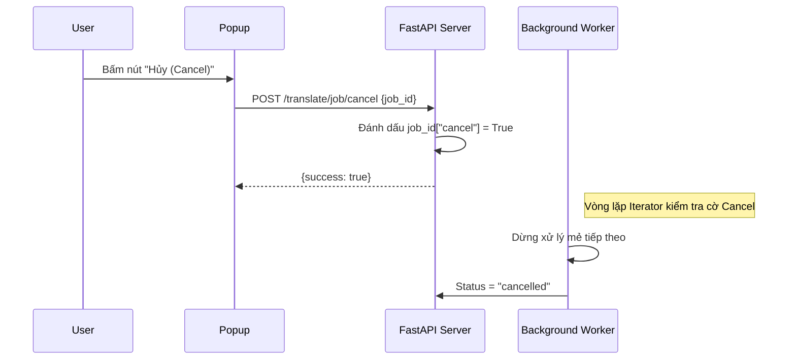

---

## 1. Tổng quan hệ thống (System Overview)

Dự án là một hệ sinh thái kết hợp giữa trình duyệt (**Chrome Extension**) và Máy chủ dịch thuật địa phương (**Python Backend Server**). 

### Mục tiêu chính:
- Hiển thị phụ đề dịch tiếng Việt (Overlay) đồng bộ với Video trên nền tảng Coursera.
- Tự động dịch file phụ đề gốc (EN) sang tiếng Việt (VI) bằng AI (Opus-MT) mà không phụ thuộc vào Internet (Dịch nội bộ).

---

## 2. Các thành phần cốt lõi (Core Components)

Hệ thống được chia làm 4 lớp tương tác:

### A. Popup UI (`popup/`)
- Giao diện điều khiển chính cho người học.
- Quản lý trạng thái: Nạp file, Chọn ngôn ngữ, Tiến độ dịch.
- Thực hiện **Polling** trạng thái dịch từ Server mỗi giây.

### B. Background Service Worker (`background.js`)
- Đóng vai trò là "Cầu nối" (Bridge).
- Tự động Inject code vào trang Coursera khi cần.
- Quản lý vòng đời Extension.

### C. Content Script (`content/`)
- Mắt xích tương tác trực tiếp với trang Web Coursera.
- Theo dõi `video.currentTime` để hiển thị đúng câu phụ đề.
- Quản lý giao diện Overlay (Kéo thả, Sync Offset).

### D. Python NMT Server (`server/`)
- Trái tim dịch thuật (FastAPI).
- Chạy các mô hình Transformer (Helsinki-NLP) trên CPU/GPU.
- Quản lý **Job Queue** để xử lý các file dài mà không làm treo UI.

---

## 3. Luồng dữ liệu Dịch thuật (Job Queue Architecture)

Để đảm bảo hiệu năng và tránh "Timeout" trên trình duyệt, hệ thống sử dụng kiến trúc **Asynchronous Job Queue**:

---

## 4. Các luồng xử lý chi tiết (Detailed Flows)

Dưới đây là các kịch bản tương tác giữa các thành phần Chrome Extension và dữ liệu:

### 4.1 Luồng nạp file Offline (Pre-translated)
Dùng khi người dùng đã có file phụ đề dịch sẵn.

### 4.2 Luồng điều chỉnh đồng bộ (Sync Offset)
Dùng phím tắt hoặc UI để khớp phụ đề.

### 4.3 Luồng khôi phục trạng thái (Persistence/Reload)
Đảm bảo phụ đề không mất khi F5 trang.

### 4.4 Luồng hủy tác vụ dịch (Job Cancellation)
Ngắt tiến trình dịch mẻ lớn trên server.

---

## 5. Công nghệ sử dụng (Tech Stack)

| Thành phần | Công nghệ | Lý do chọn |
|---|---|---|
| **Frontend** | Vanilla JS, HTML5, CSS3 | Tránh bloatware, tốc độ thực thi Content Script nhanh nhất |
| **Backend** | FastAPI (Python) | High performance, hỗ trợ Async/Background tasks cực tốt |
| **AI Model** | HuggingFace Transformers (MarianMT) | Model mã nguồn mở EN->VI chất lượng cao, chạy mượt trên CPU |
| **Storage** | `chrome.storage.local` | Lưu trữ file phụ đề, vị trí overlay... bền vững giữa các lần F5 |

---

## 5. Các cơ chế thông minh (Smart Mechanics)

- **SPA Detection:** Sử dụng `MutationObserver` để nhận diện khi người dùng chuyển bài học trên Coursera (Dynamic URL) mà không làm mất Overlay.
- **Context Guard:** Tự động phát hiện lỗi "Extension context invalidated" và hướng dẫn người dùng F5 an toàn.
- **Draggable Overlay:** Tính toán vị trí tương đối (Matrix) để duy trì vị trí phụ đề khớp với Responsive Video Player của Coursera.
